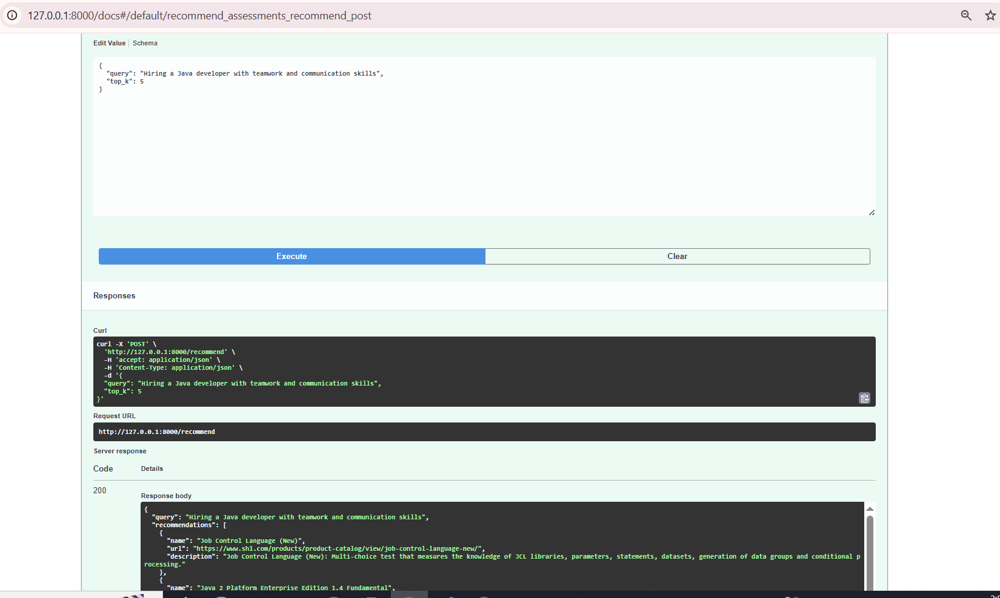
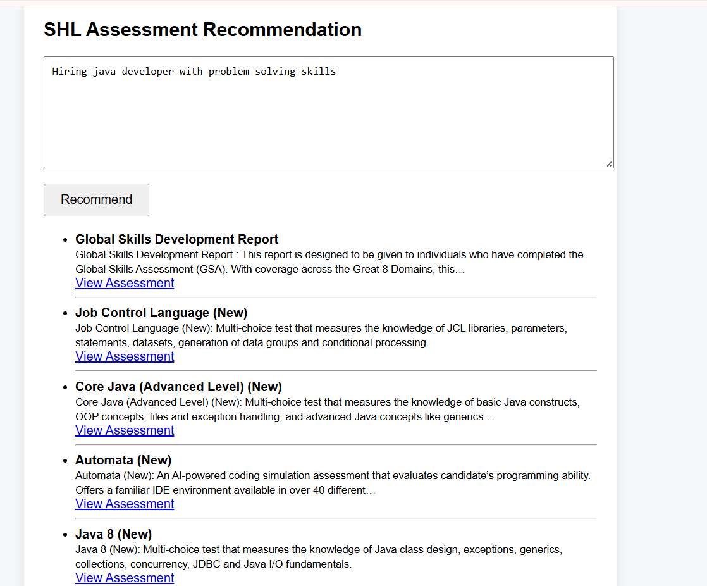

📌 SHL Assessment Recommendation System

Semantic Search-Based Assessment Matching using SBERT + FAISS

📖 Problem Statement

The goal of this project is to build a system that recommends relevant SHL assessments based on a natural language job description or hiring requirement.

Given a free-text query such as:

"Hiring a Java developer with strong problem-solving and communication skills"

The system should return the most relevant assessments from the SHL product catalog.

🧠 Approach Overview

This solution uses semantic search instead of keyword matching.

🔹 Step 1: Text Embedding

Assessment descriptions are converted into vector embeddings using:

all-MiniLM-L6-v2 (SentenceTransformers)

🔹 Step 2: Vector Indexing

Embeddings are indexed using:

FAISS (Facebook AI Similarity Search)

Enables fast nearest-neighbor retrieval.

🔹 Step 3: Query Processing

User query is embedded using the same model.

FAISS retrieves the top-K most similar assessments.

Results are returned via API and displayed on the frontend.

🏗️ Architecture
User Query (Frontend)
        ↓
FastAPI Backend (/recommend)
        ↓
SentenceTransformer (Query Embedding)
        ↓
FAISS Vector Search
        ↓
Top-K Assessment Retrieval
        ↓
JSON Response
        ↓
Frontend Display
📂 Project Structure
shl-assessment-recommendation/
│
├── api_app.py
├── evaluate.py
├── requirements.txt
│
├── data/
│   ├── assessments.csv
│   ├── assessments_with_embeddings.csv
│   ├── assessments.index
│   └── Gen_AI_Dataset.xlsx
│
├── embeddings/
│   └── build_embeddings.py
│
├── recommender/
│   └── recommend.py
│
├── frontend/
│   └── index.html
│
└── screenshots/
⚙️ How to Run the Project
1️⃣ Create Virtual Environment
python -m venv venv
venv\Scripts\activate
2️⃣ Install Dependencies
pip install -r requirements.txt
3️⃣ Build Embeddings (Only Once)
python embeddings/build_embeddings.py
4️⃣ Start Backend Server
uvicorn api_app:app --reload

Open:

http://127.0.0.1:8000/docs
5️⃣ Run Frontend

Open:

frontend/index.html
🔌 API Usage Example
POST /recommend
{
  "query": "Hiring a Python developer with analytical skills",
  "top_k": 5
}
Sample Response
{
  "query": "...",
  "recommendations": [
    {
      "name": "Assessment Name",
      "url": "https://...",
      "description": "Assessment details..."
    }
  ]
}
📊 Evaluation

The system is evaluated using Recall@10 on the provided SHL dataset.

Metric Used

Recall@K measures how many relevant assessments appear in the top-K predictions.

Result
Mean Recall@10: <your_output_here>

Due to:

Limited dataset size

General-purpose embedding model

No domain-specific fine-tuning

The recall score may be low.

However, the evaluation pipeline demonstrates correctness and can be improved further using:

Domain-specific fine-tuning

Hybrid lexical + semantic ranking

Metadata filtering

Re-ranking models

🖼️ Screenshots

Add your screenshots inside the screenshots/ folder and include them like this:

## API Example

## Frontend UI

🚀 Why This Approach?

This system uses semantic embeddings + FAISS, which:

Captures contextual meaning beyond keywords

Handles unseen queries effectively

Scales efficiently for large assessment catalogs

Provides fast retrieval suitable for production systems

This approach is more robust than traditional keyword-based search systems.

⚠️ Limitations

No fine-tuning on SHL-specific domain data

Small evaluation dataset

No hybrid re-ranking

No personalization layer

🔮 Future Improvements

Cross-encoder re-ranking

Skill extraction pipeline

Metadata-aware filtering

Hybrid BM25 + Semantic Search

Deployment on cloud (Docker + CI/CD)

🏁 Conclusion

This project demonstrates a complete end-to-end semantic recommendation pipeline:

✔ Data preprocessing
✔ Embedding generation
✔ FAISS indexing
✔ FastAPI backend
✔ Frontend integration
✔ Evaluation using Recall@10

The system is modular, scalable, and extensible for real-world enterprise use cases.